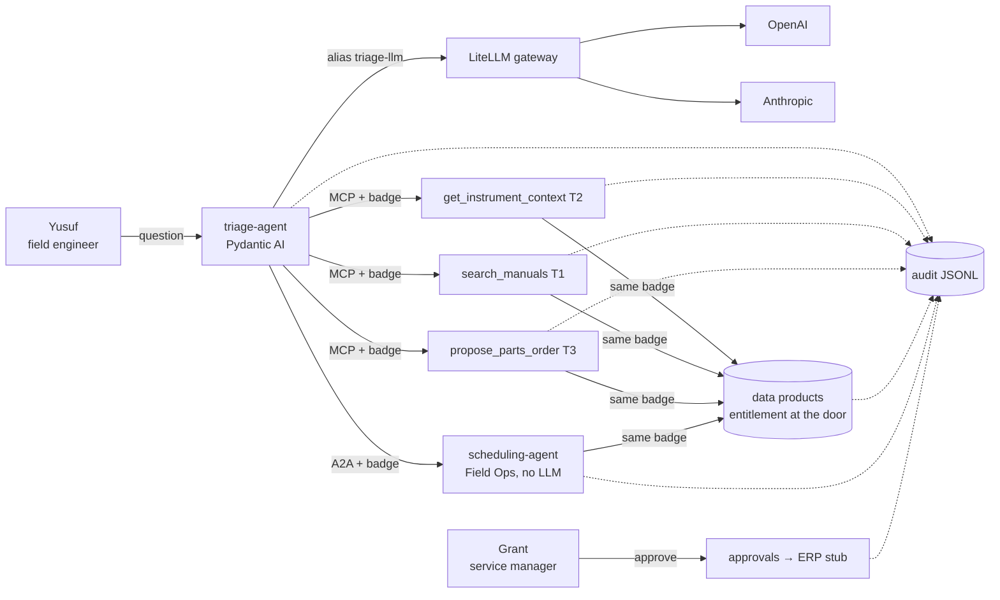

# mcp-a2a-governed-agents

A small, working **governed agent plane**: an LLM agent that triages ultra-low freezer faults through **MCP** (Model Context Protocol) skills, hands off to another team's agent over **A2A** (the agent-to-agent protocol), talks to models only through a **vendor-neutral gateway**, and is wrapped by a **harness** that decides everything an LLM shouldn't — identity on behalf of a user, entitlements, risk-tier inheritance, evidence-gated actions, audit lineage, and **eval-gated promotion**.

A *badge* below is a signed JWT carrying the user and the agent acting for them; *tiers* rate what a skill can do: T1 read manuals, T2 read customer data, T3 act (order, schedule), T4 regulated.

The scenario is synthetic (fictional *Cryonix 80* freezers, customers and engineers), so the platform is the point.



## What the harness guarantees

| Guarantee | Where |
|---|---|
| The LLM fills only judgement fields (`TriageDraft`); parts, prices, sample risk, urgency, status, visit and approval come from code | `harness/contract.py`, `agents/triage/agent.py` |
| One badge — the **user** as subject, the **agent** as `act` (RFC 8693 style) — travels every hop: agent → skill → data product, agent → agent → data product | `harness/badges.py` |
| Entitlements checked at the data product: territory, regulated records, registered agent | `harness/policy.py`, `dataproducts/app.py` |
| A composition's tier = the highest tier it touches, computed from its manifest; an agent whose manifest outgrew its certification is denied at run start, and any call above its certified tier is refused | `harness/policy.py`, `harness/registry.yaml` |
| Actions are gated by evidence: no compressor without a compressor signature, no re-order within 90 days, revision-checked kits, max 1 per part | `skills/parts.py` |
| Every action leaves an audit line: who, on behalf of whom, which agent and version, what it saw (record ids + payload hash), which model, the decision, the approver | `harness/audit.py` |
| Promotion follows from three exact gates on 30 cases (core + variations), passed in 3 repeated runs, never from judgement; the grounding checks also run at answer time, so the model is asked to fix its evidence (still-unverified answers are flagged) | `evals/`, `harness/grounding.py` |
| Swapping the model provider is one line in the gateway config | `gateway/litellm.yaml` |

Every rule (`R-ACC-1`…`R-CRT-1`) is written in [docs/DEMO_SCENARIOS.md](docs/DEMO_SCENARIOS.md) and every number it uses lives in [rules.yaml](rules.yaml).

## Run it

Needs Docker Compose ≥ 2.24 and an OpenAI API key. Scenes that ask the agent a question call the model (with `gpt-6-luna`, about $0.002 per question; a certification = 3 full runs of the 30 cases, about $0.20).

```bash
cp .env.example .env          # add OPENAI_API_KEY (and ANTHROPIC_API_KEY for the swap)
docker compose up -d --build  # gateway, data products, 3 MCP skills, scheduling agent, sandbox skill build
source scripts/demo.sh        # the `demo` command, with tab completion (needs uv: https://docs.astral.sh/uv/)
demo                          # lists every command; `demo <command> -h` lists who, which freezers and examples
```

Without uv: `alias demo='docker compose run --rm cli python -m cli'` gives the same commands, except the ones that drive Docker (`gateway use`, `stop`, `start`, `eval --background`). No Docker? `scripts/local.sh` runs every service as a local process.

| Scene | Command |
|---|---|
| Live audit stream (keep it open in a second terminal) | `demo follow`: one colored line per event as it happens; eval runs are folded into their promotion line |
| SC1 happy path (diagnosis → evidence-checked part → A2A visit → approval pending) | `demo ask yusuf "Cryonix 80 SN 5123 at BarnaLabs, error E-47, temperature creeping up."` |
| Approval | `demo approve yusuf` (refused: engineers propose) · `demo approve grant` (approved → ERP stub) |
| SC2 a skill on its own, over MCP, no LLM | `demo skill order 5123 GK-80-A` (refused, R-ORD-1) |
| SC3 provider swap | `demo gateway use sonnet` (edits the one line in `gateway/litellm.yaml`, shows the diff, restarts), re-run SC1 |
| SC4 entitlement deny (territory) | `demo ask yusuf "Faraway Pharma in Boston reports E-47 on SN 7001."` |
| SC5 tier inheritance | `demo registry` · `demo ask consuelo "Order a GasketKit 80-B for SN 5123 at BarnaLabs."` |
| SC6 audit card | `demo view` (last question) · `demo view <trace> --raw` |
| SC7 eval gates → promotion | `demo eval rc` (candidate with the parts-skill bug → BLOCKED) · `demo eval current` (pass^3) · `demo promotions` |
| SC8 break a seam | `demo stop scheduling-agent`, re-run SC1 → proposal stands, flag `scheduling_unavailable` · `demo start scheduling-agent` |
| SC9 the two stubs | `demo stubs` |

## Honest limits

Local demo only: the gateway is unauthenticated, so ports are bound to `127.0.0.1`. Two deliberate stubs, marked `# STUB:` in the code: the **identity provider** (badges are real signed JWTs, but minted locally) and **ERP submission** (an approved order is logged, not sent). Everything simplified or left out, and what production needs instead, is in [docs/PATH_TO_PRODUCTION.md](docs/PATH_TO_PRODUCTION.md).

## Repo map

```
agents/triage/       Pydantic AI agent + harness post-processing      skills/        3 MCP servers
agents/scheduling/   A2A server (deterministic)                       dataproducts/  FastAPI over data/
harness/             badges, policy, contract, audit, registry        gateway/       LiteLLM config
evals/               cases, gates, runner, consistency check          cli/           ask, skill, approve, view
data/                synthetic data (+ WHY.md: why each record exists) docs/         rules, contract, stack, path to production
```

## Tests

```bash
uv run python -m tests.run            # unit tests, no services, no LLM
uv run python -m tests.live_scripted  # full chain against running services with a scripted model (no API cost)
uv run python evals/check_cases.py    # every eval case points at real records, rules and slots
```

MIT licensed.
