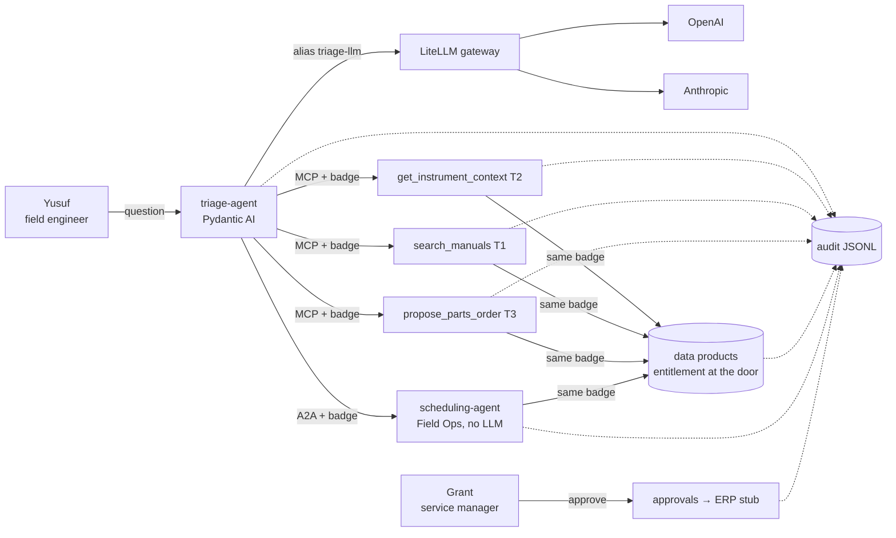

# mcp-a2a-governed-agents

A small, working **governed agent plane**: an LLM agent that triages ultra-low freezer faults through **MCP skills**, hands off to another team's agent over **A2A**, talks to models only through a **vendor-neutral gateway**, and is wrapped by a **harness** that decides everything an LLM shouldn't — identity on behalf of a user, entitlements, risk-tier inheritance, evidence-gated actions, audit lineage, and **eval-gated promotion**.

The scenario is synthetic (fictional *Cryonix 80* freezers, customers and engineers), so the platform is the point.



## What the harness guarantees

| Guarantee | Where |
|---|---|
| The LLM fills only judgement fields (`TriageDraft`); parts, prices, sample risk, urgency, status, visit and approval come from code | `harness/contract.py`, `agents/triage/agent.py` |
| One badge — the **user** as subject, the **agent** as `act` (RFC 8693 style) — travels every hop: agent → skill → data product, agent → agent → data product | `harness/badges.py` |
| Entitlements checked at the data product: territory, regulated records, registered agent | `harness/policy.py`, `dataproducts/app.py` |
| A composition's tier = the highest tier it touches, computed from its manifest; an agent whose manifest outgrew its certification doesn't run | `harness/policy.py`, `harness/registry.yaml` |
| Actions are gated by evidence: no compressor without a compressor signature, no re-order within 90 days, revision-checked kits, max 1 per part | `skills/parts.py` |
| Every action leaves an audit line: who, on behalf of whom, which agent and version, what it saw (record ids + payload hash), which model, the decision, the approver | `harness/audit.py` |
| Promotion follows from three exact gates on 29 cases (core + variations), never from judgement | `evals/` |
| Swapping the model provider is one line in the gateway config | `gateway/litellm.yaml` |

Every rule (`R-ACC-1`…`R-CRT-1`) is written in [docs/DEMO_SCENARIOS.md](docs/DEMO_SCENARIOS.md) and every number it uses lives in [rules.yaml](rules.yaml).

## Run it

```bash
cp .env.example .env          # add OPENAI_API_KEY (and ANTHROPIC_API_KEY for the swap)
docker compose up -d --build  # gateway, data products, 3 MCP skills, scheduling agent, sandbox skill build
alias demo='docker compose run --rm cli python -m'
```

No Docker? `scripts/local.sh` runs every service as a local process (needs [uv](https://docs.astral.sh/uv/)), and the same commands work as `uv run python -m …`.

| Scene | Command |
|---|---|
| SC1 happy path (diagnosis → evidence-checked part → A2A visit → approval pending) | `demo cli.ask "Cryonix 80 SN 5123 at BarnaLabs, error E-47, temperature creeping up."` |
| SC2 a skill on its own, over MCP, no LLM | `demo cli.skill propose_parts_order '{"serial": "5123", "part_number": "GK-80-A"}'` |
| SC3 provider swap | edit the `model:` line under `triage-llm` in `gateway/litellm.yaml`, `docker compose restart gateway`, re-run SC1 |
| SC4 entitlement deny (territory) | `demo cli.ask "Faraway Pharma in Boston reports E-47 on SN 7001."` |
| SC5 tier inheritance | `demo cli.view --registry` · `demo cli.ask --as consuelo --agent quick-lookup "Order a GasketKit 80-B for SN 5123"` |
| SC6 audit card | `demo cli.view` (last question) · `demo cli.view <trace> --raw` |
| SC7 eval gates → promotion | `demo evals.run` (certified build) · `docker compose run --rm -e SKILL_PARTS_URL=http://skill-parts-rc:8113/mcp cli python -m evals.run --candidate "1.1-rc (parts skill 0.4)"` · `demo cli.view --promotions` |
| SC8 break a seam | `docker compose stop scheduling-agent`, re-run SC1 → proposal stands, flag `scheduling_unavailable` |
| Approval | `demo cli.approve <proposal_id> --as yusuf` (refused) · `--as grant` (approved → ERP stub) |

## Honest limits

Two deliberate stubs, marked `# STUB:` in the code: the **identity provider** (badges are real signed JWTs, but minted locally) and **ERP submission** (an approved order is logged, not sent). Everything simplified or left out, and what production needs instead, is in [docs/PATH_TO_PRODUCTION.md](docs/PATH_TO_PRODUCTION.md).

## Repo map

```
agents/triage/       Pydantic AI agent + harness post-processing      skills/        3 MCP servers
agents/scheduling/   A2A server (deterministic)                       dataproducts/  FastAPI over data/
harness/             badges, policy, contract, audit, registry        gateway/       LiteLLM config
evals/               cases, gates, runner, consistency check          cli/           ask, skill, approve, view
data/                synthetic data (+ WHY.md: why each record exists) docs/         rules, contract, stack, path to production
```

## Tests

```bash
uv run python -m tests.run            # unit tests, no services, no LLM
uv run python -m tests.live_scripted  # full chain against running services with a scripted model (no API cost)
uv run python evals/check_cases.py    # every eval case points at real records, rules and slots
```

MIT licensed.
